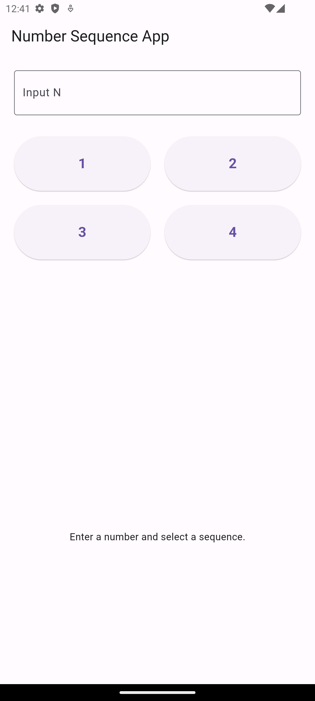
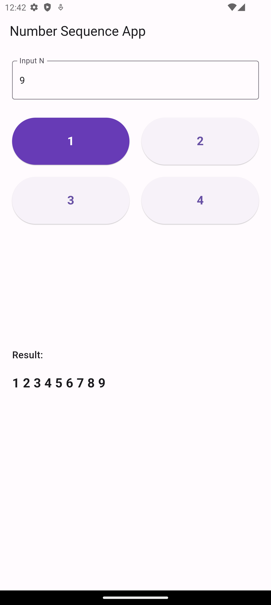
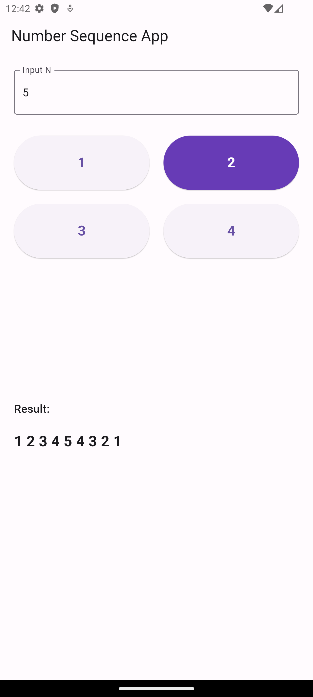
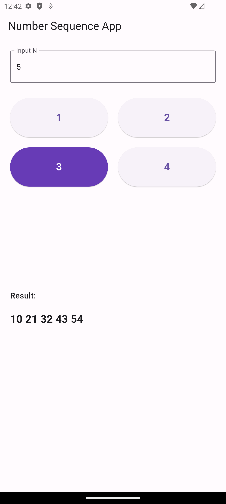
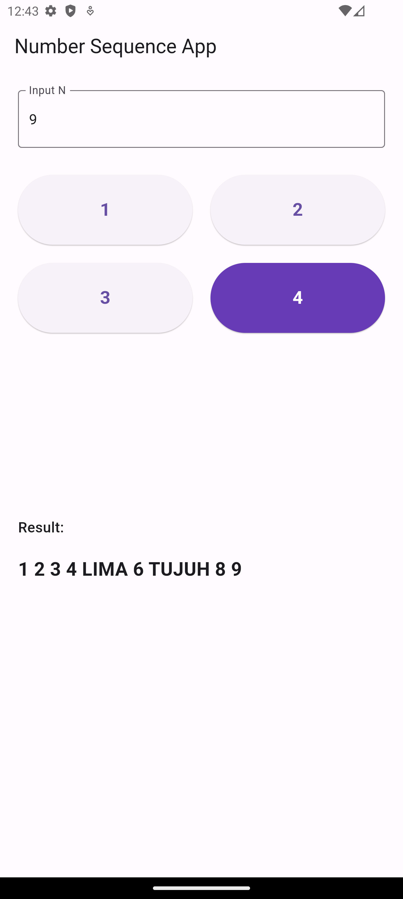

# Number Sequence App

### Screenshot:

## How to Run the App

Here are the steps to run this application:

### Prerequisites

Make sure you have Flutter installed on your computer. For Flutter installation instructions, visit the [official Flutter documentation](https://flutter.dev/docs/get-started/install).

### Steps

1. Clone this repository to your computer:

git clone https://github.com/RepoRandi/flutter-number-sequence.git

2. Open a terminal and navigate to the project directory:

cd flutter-number-sequence

3. Run the app:

flutter run

This will start the app on the emulator or connected device.

## Contributing

If you'd like to contribute to this project, please create a pull request with your proposed changes. We will review it as soon as possible.

Thank you for using this app!

